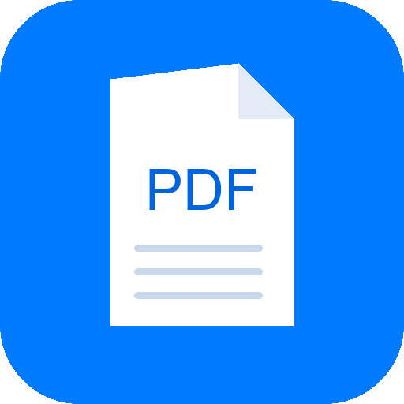

# PDFOS — PDF - OS (Open Source)

<p align="center">
  
</p>

<p align="center">
  <strong>A powerful, open-source PDF toolkit with an iOS-inspired interface.</strong><br>
  Convert, edit, secure, extract, and optimize PDF files — all in one app.
</p>

<p align="center">
  <a href="https://github.com/myst-25/PDF-OS/releases">Download</a> •
  <a href="https://t.me/Myst_25">Telegram</a> •
  <a href="#features">Features</a> •
  <a href="#installation">Installation</a>
</p>

---

## Features

### 🔄 Conversion
Convert PDFs to and from 12+ formats:
- **From PDF**: Images (PNG/JPEG), Word, Excel, PowerPoint, HTML, Markdown, Text, CSV, JSON, XML, PDF/A
- **To PDF**: Images, HTML, Markdown

### 📄 Page Manipulation
- **Merge** — Combine multiple PDFs
- **Split** — By pages or custom ranges
- **Rotate** — 90°, 180°, 270°
- **Delete / Extract** — Remove or isolate pages
- **Reverse** — Flip page order
- **Crop** — Trim margins

### ✏️ Editing
- **Watermarks** — Text or image overlays
- **Headers / Footers** — With optional page numbers
- **Page Numbers** — Multiple positions
- **Redact** — Permanently black out text

### 🔍 Extraction
- **Text** — Full OCR-quality text extraction
- **Images** — Extract all embedded images
- **Tables** — Structured table data
- **Metadata** — Author, title, dates
- **Fonts / Links / Bookmarks / Attachments**
- **Full-text Search** — Find text across pages

### 🔒 Security
- **Encrypt** — Password protect with permissions
- **Decrypt** — Remove passwords
- **Permissions** — Granular print/copy/modify/annotate controls
- **Check** — Verify encryption status

### ⚡ Optimization
- **Compress** — Reduce file size with quality control
- **Linearize** — Optimize for web viewing
- **Downsample** — Reduce image resolution
- **Repair** — Fix corrupted PDFs
- **Remove Metadata** — Privacy cleanup
- **Grayscale** — Convert to black & white

### 🎨 Interface
- iOS-inspired design (Segoe UI / SF Pro fonts)
- Real-time CPU & RAM monitoring
- Animated progress bars
- Process → Save workflow
- Dark & Light mode toggle

---

## Installation

### Download Pre-built Binary (Recommended)

Go to [Releases](https://github.com/myst-25/PDF-OS/releases) and download for your platform:

| Platform | File |
|----------|------|
| Windows | `PDFOS-Windows.tar.gz` |
| Linux | `PDFOS-Linux.tar.gz` |
| macOS | `PDFOS-macOS.tar.gz` |

Extract and run `PDFOS` (or `PDFOS.exe` on Windows).

### Build from Source

**Requirements**: Python 3.10+

```bash
# Clone
git clone https://github.com/myst-25/PDF-OS.git
cd PDF-OS

# Install dependencies
pip install -r requirements.txt

# Run
python main.py
```

### Build Standalone Executable

```bash
# Install PyInstaller
pip install pyinstaller

# Build (Windows)
python -m PyInstaller --noconfirm --onedir --windowed --name "PDFOS" \
  --icon "assets/icon.ico" \
  --add-data "core;core" --add-data "ui;ui" --add-data "utils;utils" --add-data "assets;assets" \
  --collect-all customtkinter --hidden-import psutil --hidden-import PIL._tkinter_finder \
  main.py

# Build (Linux/macOS) — use : instead of ;
python -m PyInstaller --noconfirm --onedir --windowed --name "PDFOS" \
  --add-data "core:core" --add-data "ui:ui" --add-data "utils:utils" --add-data "assets:assets" \
  --collect-all customtkinter --hidden-import psutil --hidden-import PIL._tkinter_finder \
  main.py

# Output in dist/PDFOS/
```

---

## Dependencies

| Package | Purpose |
|---------|---------|
| `customtkinter` | Modern UI framework |
| `PyMuPDF (fitz)` | Core PDF engine |
| `pypdf` | PDF manipulation |
| `Pillow` | Image processing |
| `pdfplumber` | Table extraction |
| `pdf2docx` | PDF to Word |
| `python-docx` | Word file creation |
| `openpyxl` | Excel file creation |
| `python-pptx` | PowerPoint creation |
| `reportlab` | PDF generation |
| `python-barcode` | Barcode support |
| `qrcode` | QR code support |
| `markdown` | Markdown rendering |
| `psutil` | CPU/RAM monitoring |

---

## Project Structure

```
PDF-OS/
├── main.py                 # Entry point
├── requirements.txt        # Dependencies
├── assets/
│   ├── icon.png            # App icon
│   └── icon.ico            # Windows icon
├── core/                   # PDF processing engines
│   ├── conversion.py
│   ├── page_manipulation.py
│   ├── editing.py
│   ├── extraction.py
│   ├── security.py
│   └── optimization.py
├── ui/                     # Interface
│   ├── app.py              # Main window
│   ├── ios_widgets.py      # iOS design system
│   ├── progress_widget.py  # Animated progress bar
│   └── tabs/               # Tool panels
│       ├── conversion_ui.py
│       ├── page_manip_ui.py
│       ├── editing_ui.py
│       ├── extraction_ui.py
│       ├── security_ui.py
│       └── optimization_ui.py
├── utils/
│   ├── logger.py           # Console logging
│   └── resource_monitor.py # CPU/RAM monitor
├── .github/workflows/      # GitHub Actions CI/CD
└── .gitlab-ci.yml          # GitLab CI/CD
```

---

## Contributing

1. Fork the repo
2. Create a feature branch (`git checkout -b feature/my-feature`)
3. Commit changes (`git commit -m "Add my feature"`)
4. Push (`git push origin feature/my-feature`)
5. Open a Pull Request

---

## License

This project is licensed under the **MIT License** — see [LICENSE](LICENSE) for details.

Free for personal and commercial use.

---

## Links

- **GitHub**: [github.com/myst-25/PDF-OS](https://github.com/myst-25/PDF-OS)
- **GitLab**: [gitlab.com/myst25/pdf-os](https://gitlab.com/myst25/pdf-os)
- **Telegram**: [t.me/Myst_25](https://t.me/Myst_25)

---

<p align="center">Made with ❤️ by <a href="https://github.com/myst-25">myst-25</a></p>
